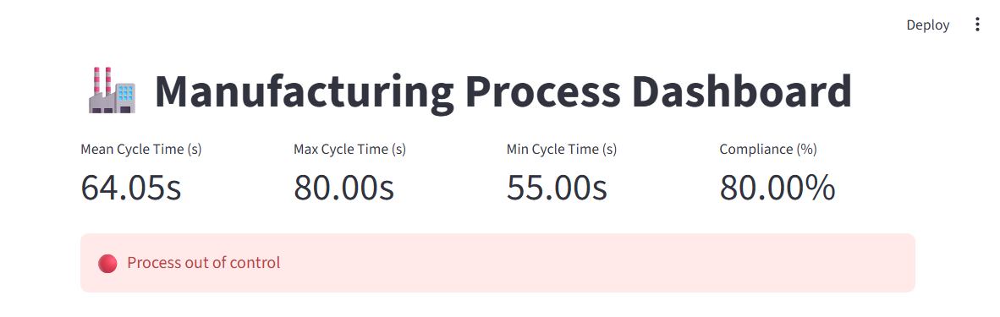
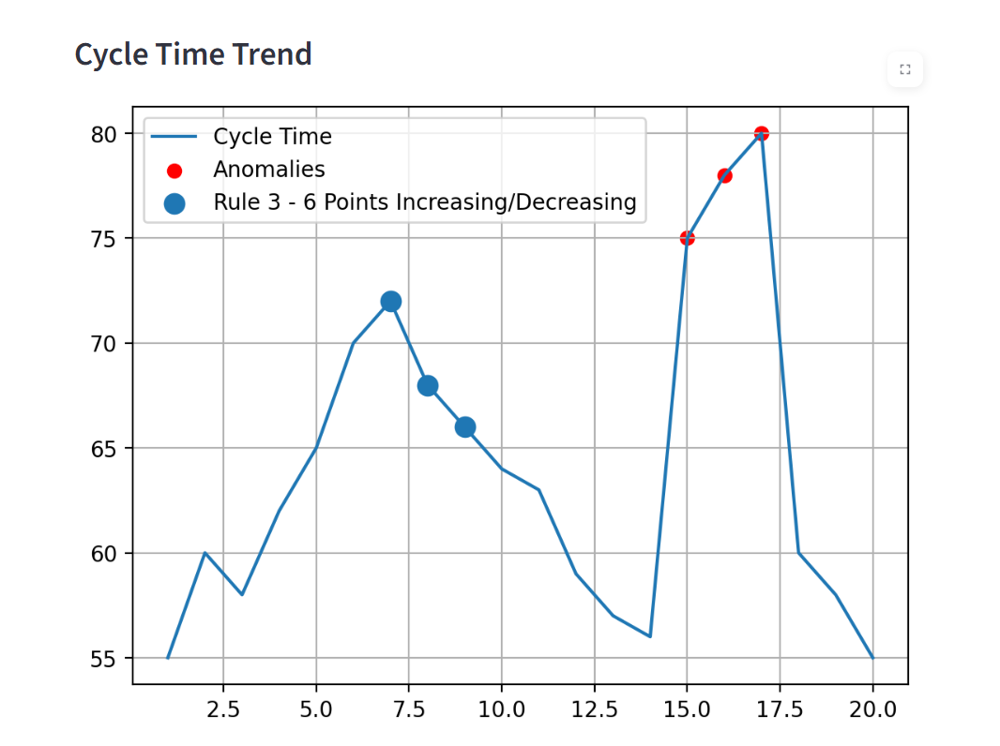

# 🏭 Manufacturing Process Control Dashboard

## 📊 Overview

This project analyzes manufacturing cycle time data using **Statistical Process Control (SPC)** and **Six Sigma principles**.

It provides a complete pipeline for:

* Data analysis
* KPI calculation
* Anomaly detection
* Six Sigma rule validation
* Interactive dashboard visualization

## 🚀 Features

### 📈 Data Analysis

* Mean, Max, Min, Standard Deviation
* Process variability metrics
* Coefficient of variation

### ⚠️ Anomaly Detection

* Detection of values outside specification limits
* Highlighted directly in charts and dashboard

### 🧠 Six Sigma Rules (SPC)

Implemented industrial-level quality rules:

* Rule 1: Points outside ±3σ
* Rule 2: 9 consecutive points on the same side of the mean
* Rule 3: 6 consecutive increasing or decreasing points
* Rule 4: 14 alternating points up and down

### 📊 Visualization

* Time series plot (Matplotlib)
* Control chart (SPC)
* Highlighted anomalies and rule violations

### 📁 Excel Report Export

Automatically generates a report with:

* Raw data
* KPIs
* Six Sigma violations (per rule)

### 💻 Interactive Dashboard (Streamlit)

* KPI cards (mean, max, min, compliance)
* Process status (stable / warning / out of control)
* Interactive charts
* Tables with detected anomalies and violations

## 🛠️ Technologies

* Python
* Pandas
* Matplotlib
* Streamlit
* OpenPyXL

## 📈 Concepts Applied

* Lean Manufacturing
* Six Sigma
* Statistical Process Control (SPC)
* Process Stability Analysis
* Data-Driven Decision Making

## ▶️ How to Run

### 1️⃣ Install dependencies

```bash
pip install -r requirements.txt
```

### 2️⃣ Run data analysis (generate reports and plots)

```bash
python main.py
```

### 3️⃣ Run dashboard

```bash
python -m streamlit run dashboard.py
```

## 📸 Dashboard Preview




## 📊 Control Chart (SPC)




## 📂 Project Structure

```
project/
│
├── data/
│   └── cycle_time.csv
│
├── results/
│   ├── cycle_time_plot.png
│   ├── control_chart.png
│   └── report.xlsx
│
├── main.py
├── dashboard.py
├── requirements.txt
└── README.md
```

## 💼 About This Project

This project was developed as a **portfolio project for Industrial / Production Engineering**, focusing on real-world applications of:

* Process monitoring
* Quality control
* Data analysis in manufacturing

## 📌 Future Improvements

* Real-time data integration
* Advanced SPC rules
* Machine learning for anomaly prediction
* Deployment (Streamlit Cloud)